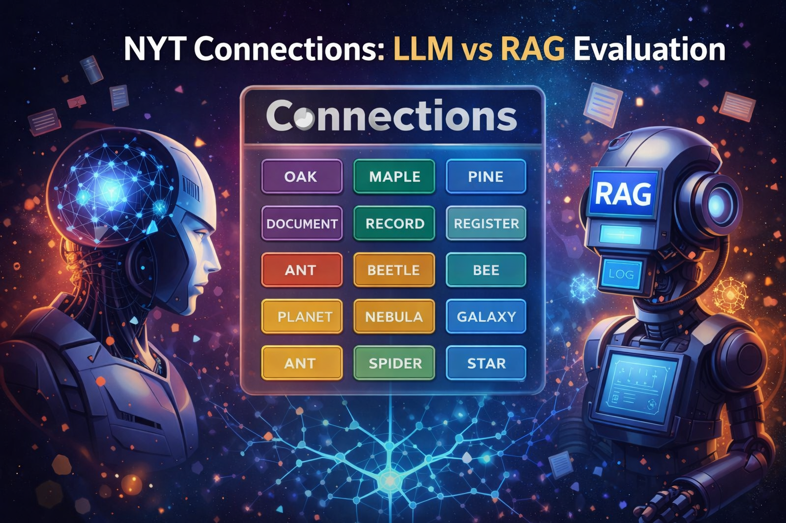

<p align="center">
  
</p>

# NYT Connections: LLM vs RAG Evaluation

This project evaluates whether Retrieval-Augmented Generation (RAG) improves the performance and reliability of Large Language Models (LLMs) on the NYT _Connections_ word-grouping puzzle.

We compare:

1. A baseline LLM approach (no retrieval)
2. A RAG-based LLM pipeline

The objective is to measure differences in puzzle solve rate, group-level accuracy, and reasoning consistency.

## Source Code

The baseline and RAG-based LLM source codes will be in the `notebooks/` directory.

Any other helper functions and files will be found in the `src/` directory.

## Dataset

We use publicly available NYT Connections-style datasets (not included in this repository):

- [NYT Connections Dataset 1](https://www.kaggle.com/datasets/tm21cy/nyt-connections)
- [NYT Connections Dataset 2](https://www.kaggle.com/datasets/eric27n/the-new-york-times-connections)

After downloading, place the dataset files inside the `data/` directory.

### Important

- The `data/` directory is intentionally excluded from version control.
- No dataset files are tracked in this repository.
- This prevents accidental upload of large or licensed data.

## Results and Experiment Outputs

All experiment outputs (predictions, logs, metrics, intermediate files) are stored locally in the `results/` directory.
The `results/` directory is intentionally excluded from version control.

This ensures:

- Clean version control history
- No large generated files in the repository
- Reproducibility of code without storing output artifacts

## Environment Setup

This repository includes an `environment.yml` file for reproducibility.

If you do not already have a suitable conda environment with the required dependencies installed, create one using:

```bash
conda env create -f environment.yml
conda activate nyt-connections-rag
jupyter lab
```

If you already have a conda environment configured with the necessary dependencies, you may use your existing setup instead.
