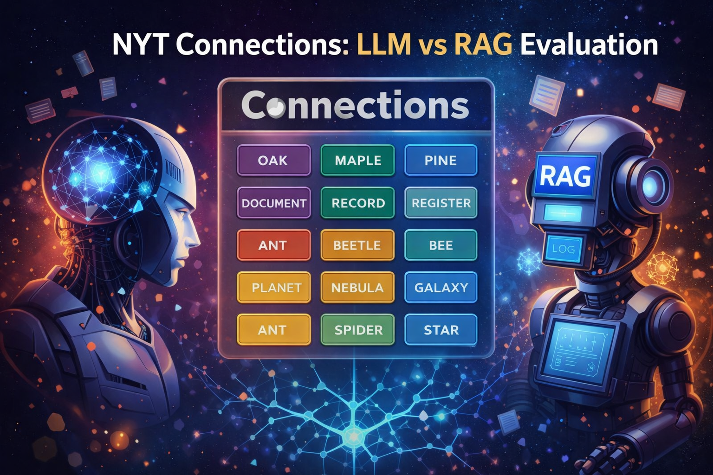

<div align="center">
  
  <h1>NYT Connections: LLM vs RAG Evaluation</h1>
</div>
</br>

# NYT Connections Project

This project evaluates whether external semantic knowledge can improve the performance of Large Language Models (LLMs) on the New York Times _Connections_ word-grouping puzzle.

In the NYT _Connections_ game, the model is given 16 words and must divide them into four correct groups of four related words. This task is challenging because many puzzles include misleading associations, abstract categories, and relationships that are not always based on direct word similarity.

We compare three approaches:

1. **Baseline LLM Approach**  
   The model solves the puzzle using only the 16 input words, without any external retrieval or semantic support.

2. **RAG-Based LLM Pipeline**  
   The model receives additional semantic context retrieved from WordNet-based documents using vector search.

3. **Agentic Database Search Approach**  
   The model uses WordNet-based semantic relationships, including similarity scores, definitions, hypernyms, and related lexical information, to support its grouping decisions.

The objective is to compare these approaches using puzzle completion rate, group-level accuracy, and partial accuracy metrics.

## Repo Structure

- `assets\` Contains the README Image.
- `data/` Dataset files should be placed here after downloading. For now there are links to access the data.
- `notebooks/` Contains the main program: `NYTConnection-All.ipynb`
- `old_notebooks/` Contains legacy and old code.
- `results/` Results should be placed here after downloading. For now these can be found in the code file under `notebooks/` directory and from the report.

## Dataset

We use publicly available NYT Connections-style dataset (not included in this repository):

- [NYT Connections Dataset 1](https://www.kaggle.com/datasets/tm21cy/nyt-connections)

After downloading the dataset, place the required dataset file inside the `data/` directory.

The exact dataset filename/path used by the notebook can be found in the main notebook and is also discussed in the project report.

### Important

- The `data/` directory may exist locally, but dataset files are not included in this repository.
- Dataset files are intentionally excluded from version control.
- This helps avoid uploading large or externally licensed data files.

## Environment Setup

This repository includes an `environment.yml` file for reproducibility.

### Important Prerequisite: API Key Setup

Before running the notebook, create a `.env` file in the root directory of the project and add your API key.

This project uses an OpenAI-compatible API client. If using OpenAI directly, add:

```bash
OPENAI_API_KEY=your_api_key_here
```

If using OpenRouter, add:

```bash
OPENROUTER_API_KEY=your_api_key_here
```

**Do not commit the `.env` file to GitHub.**

If you do not already have a suitable conda environment with the required dependencies installed, create one using:

```bash
conda env create -f environment.yml
conda activate nyt-connections-rag
jupyter lab
```

If you already have a conda environment configured with the necessary dependencies, you may use your existing setup instead.

## AI & Tools Usage Statement

AI tools were used as part of the development and documentation process for this project.

- ChatGPT was used for organizing and refining README documentation.
- Claude was used for assiting with NYTConnection-All.ipynb.
- Grammarly was used to assist with grammar editing in the final report.
